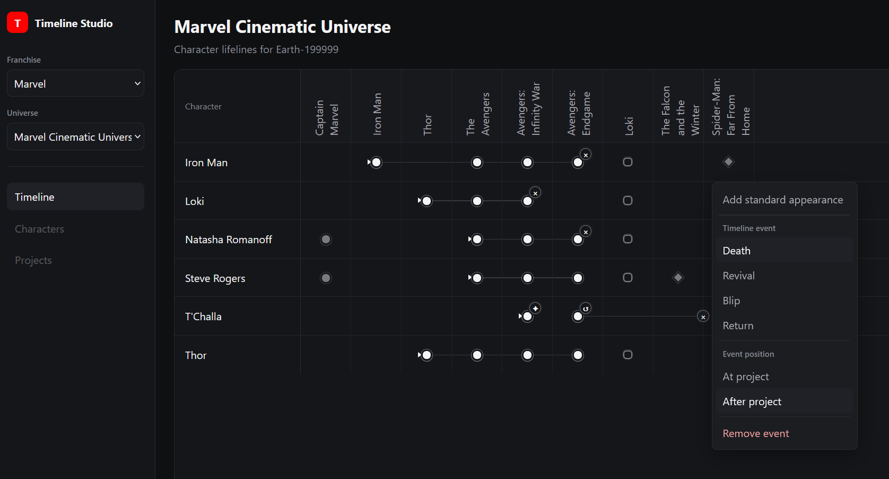

# Timeline Studio: Marvel Timelines

_A personal tool for exploring and editing fictional-media timelines,
starting with the Marvel Cinematic Universe._

Inspired by an Excel workflow, Timeline Studio places characters in rows
and projects in chronological columns, with appearance markers and
automatically calculated character lifelines.

## Current version — `0.2.0`

Franchise and universe workspaces, and improved loading and error handling.

> 

## The Aim

To build a feature-packed application showing various film franchise timelines with up-to-date project and character viewers and statistics.

## Screenshots

See the [progress screenshots](docs/images).

## Stack

