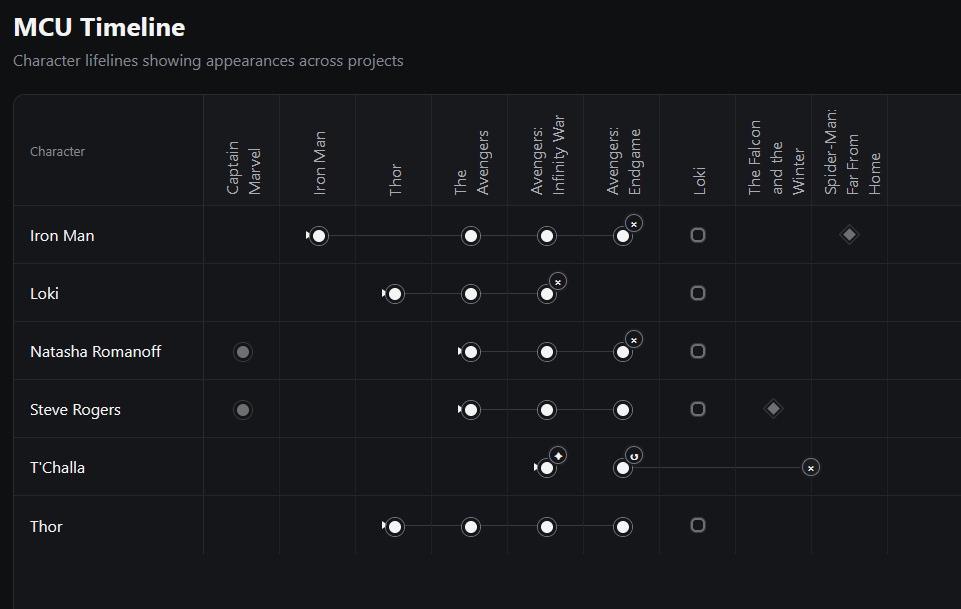

# Timeline Studio: Marvel Timelines

_A personal, responsive viewer and editor of movie timelines and characters._

## The Aim

To build a feature-packed application with several franchise timelines, and up-to-date project and character viewers and statistics.

## Progress

> Version 0.1.3: Advanced Connectors & Character Events
> 
> 

See all progress screenshots [here](docs/images).

## Stack

